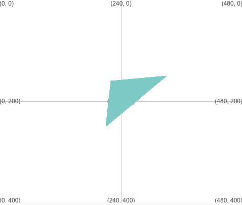

ارسم مثلثًا باستخدام: `triangle(x1, y1, x2, y2, x3, y3)`

سيتم رسم المثلث باستخدام حركة سريعة والتعبئة التي تم تعيينها قبل استدعاء `triangle`.

--- code ---
---
language: python
filename: main.py
---

  triangle(210, 250, 330, 150, 220, 160) # (x1, y1), (x2, y2), (x3, y3)

--- /code ---

سيتم رسم المثلث بزاوية عند كل من الإحداثيات الثلاثة المعطاة بـ (x1، y1)، (x2، y2)، (x3، y3).

