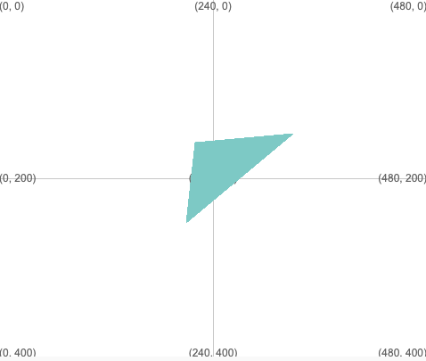

Lluniwch driongl gan ddefnyddio: `triangle(x1, y1, x2, y2, x3, y3)`

Bydd y triongl yn cael ei lunio gan ddefnyddio'r gwerthoedd strôc a llenwi sydd wedi'u gosod cyn galw `triangle`.

--- code ---
---
language: python
filename: main.py
---

  triangle(210, 250, 330, 150, 220, 160) # (x1, y1), (x2, y2), (x3, y3)

--- /code ---

Bydd y triongl yn cael ei lunio gyda chornel ym mhob un o'r tri chyfesuryn sy'n cael eu rhoi gan (x1, y1), (x2, y2), (x3, y3).

