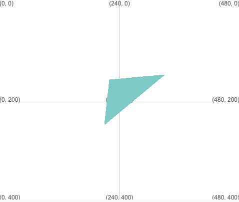

Dibuja un triángulo usando: `triangle(x1, y1, x2, y2, x3, y3)`

El triángulo se dibujará utilizando los valores de stroke (trazo) y fill (relleno) que se han establecido antes de llamar a `triangle`.

--- code ---
---
language: python
filename: main.py
---

  triangle(210, 250, 330, 150, 220, 160) # (x1, y1), (x2, y2), (x3, y3)

--- /code ---

El triángulo se dibujará con una esquina en cada una de las tres coordenadas dadas por (x1, y1), (x2, y2), (x3, y3).

